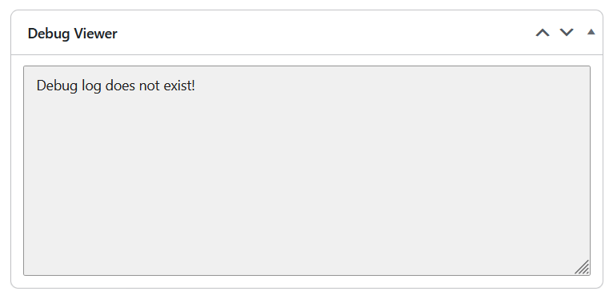

# Debug Viewer

This WordPress plugin allows site administrators to view the debug logs from the dashboard widget and allows to delete the log file.

## Screenshot ##

<figure>

<figcaption>Debug Viewer Dashboard Widget.</figcaption>
</figure>

